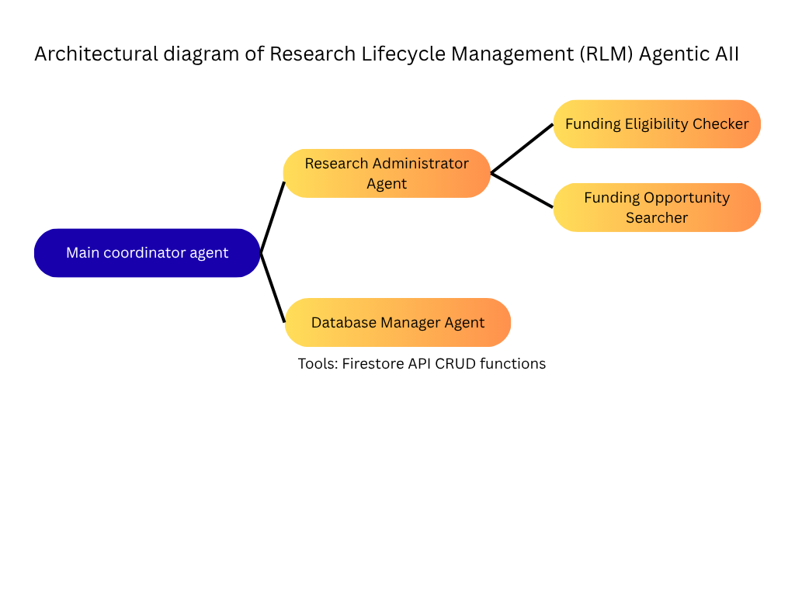
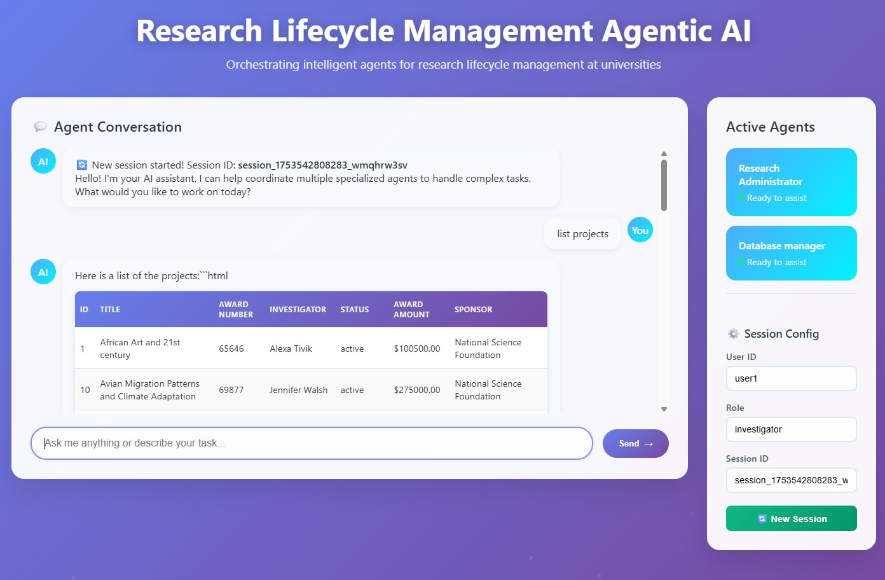

## 2. `ARCHITECTURE.md`

```markdown
# Architecture Overview



## Components

1. **User Interface**  
   - User interface is plain HTML, run by 'python -m http.server 8000' command.
   
   

2. **Agent Core**  
   - **Planner**: The agent is asked to 
   - **Executor**: LLM prompt + tool-calling logic  
   - **Memory**: vector store, cache, or on-disk logs  

3. **Tools / APIs**  
   - Google Gemini used as LLM model
   - Firestore database is used to view, create and update projects, people


4. **Observability**  
   - Basic error handling / retries are handled in `generate_responses()` function in `src/agent.py` file

