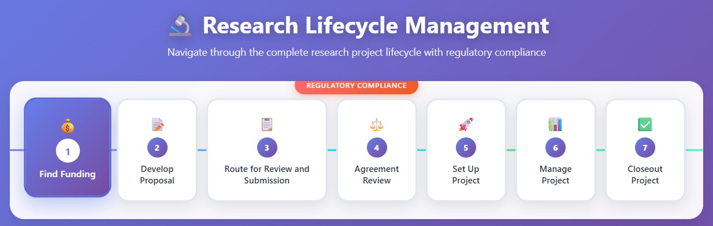

# Research Lifecycle Management Agentic AI

The purpose of this project is to develop prototype functions for Research Lifecycle Management Agentic AI to be used at institutions where research projects are conducted at large scale such as universities, colleges, etc. It is a complex process and this project develops foundations of the framework. Research lifecycle consists of the following stages.



## Setup instructions

### Running the backend

The backend runs as Quart http server on http://127.0.0.1:5000/chat

```
# in repo root folder
python -m venv venv
pip install Quart quart-cors google-adk dotenv firebase-admin
python src/agent.py
```

### Running the frontend

The frontend is a simple HTML file for demo purposes.

```
cd src/frontend
python -m http.server 8000
```

Please adjust ports if you have to run on different ports.